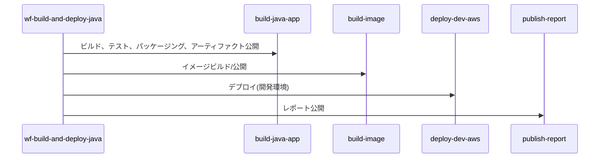
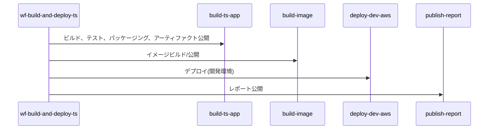
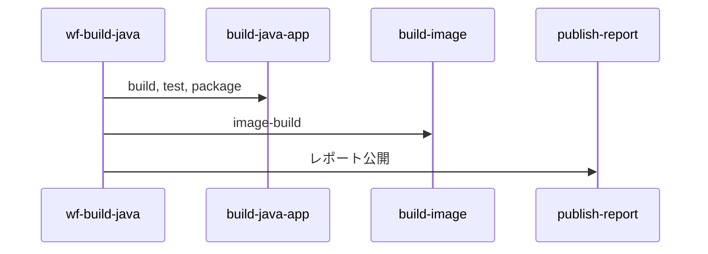
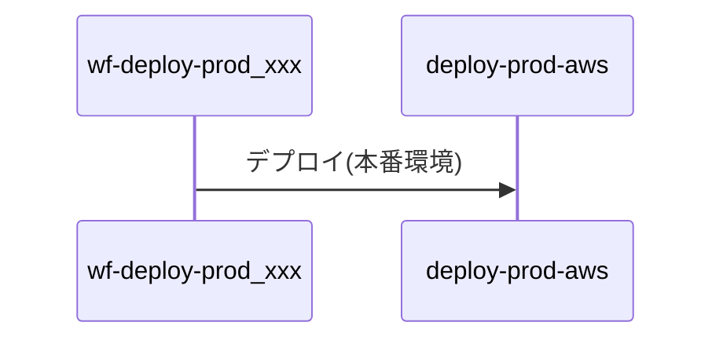
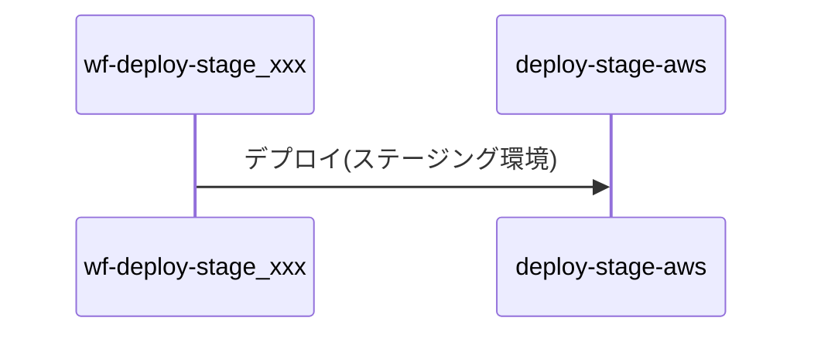

# サンプルコードの説明

## サンプルコード構成

* :file_folder: .github
  * pull_request_template.yaml：PRテンプレート(※1)
  * release.yaml：リリースノート自動生成(※1)
  * :file_folder: workflows: ワークフローを格納しているディレクトリ
    * build-image.yaml: イメージビルド(※2)
    * build-java-app.yaml: Java+Mavenアプリケーションビルド(※2)
    * build-ts-app.yaml: TS+Nodeアプリケーションビルド(※2)
    * deploy-dev-aws.yaml: 開発環境へのデプロイ(※3)
    * deploy-prod-aws.yaml: 本番環境へのデプロイ(※3)
    * deploy-stage-aws.yaml ステージング環境へのデプロイ(※3)
    * publish-report.yaml: レポートの公開(※2)
    * wf-build-and-deploy-java.yaml(※3)
    * wf-build-and-deploy-ts.yaml(※3)
    * wf-build-java.yaml(※3)
    * wf-build-ts.yaml(※3)
    * wf-deploy-prod_customer-service.yaml(※4)
    * wf-deploy-prod_order-service.yaml(※4)
    * wf-deploy-stage_customer-service.yaml(※4)
    * wf-deploy-stage_order-service.yaml(※4)
    * :file_folder:template
      * deploy-env-aws.yaml: デプロイ：AWS ECRへのイメージプッシュ、ECS更新
      * deploy-env_backend.yaml: コンテナで動作するアプリケーションのデプロイ

※1: そのまま利用可能  
※2: 技術スタックが同じなら、そのまま利用できる再利用可能ワークフロー  
※3: 技術スタックが同じ　かつ　環境情報の設定が十分なら、そのまま利用できる再利用可能ワークフロー  
※4: これを例としてアプリケーションに合わせた実装が必要。

### wf-build-and-deploy-java

developブランチへのプッシュをトリガーとしたワークフロー

### wf-build-and-deploy-ts

wf-build-and-deploy-javaのTypeScript版

### wf-build-java

featureブランチへのプッシュをトリガーとしたワークフロー

### wf-build-ts

wf-build-javaのTypeScript版

### wf-deploy-prod_customer-service, wf-deploy-prod_order-service

デプロイ(本番環境)

### wf-deploy-stage_customer-service, wf-deploy-stage_order-service

デプロイ(ステージング環境)

