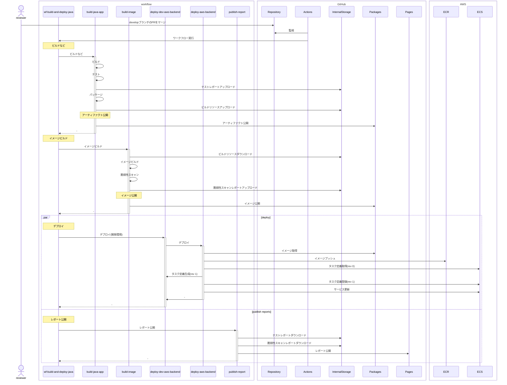
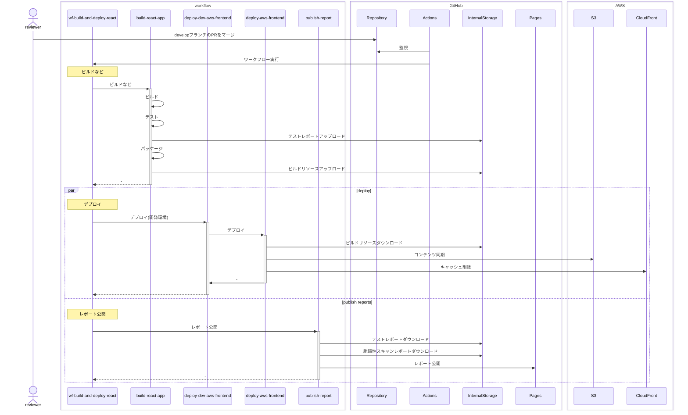
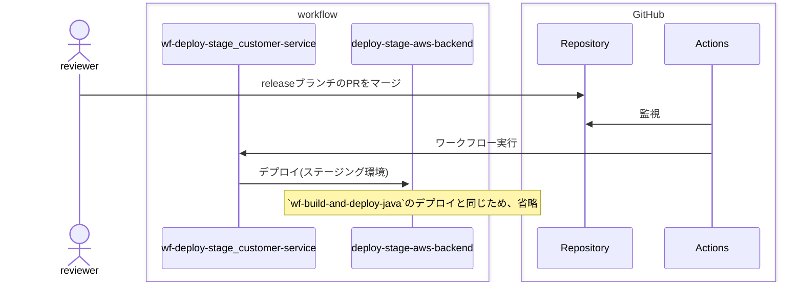
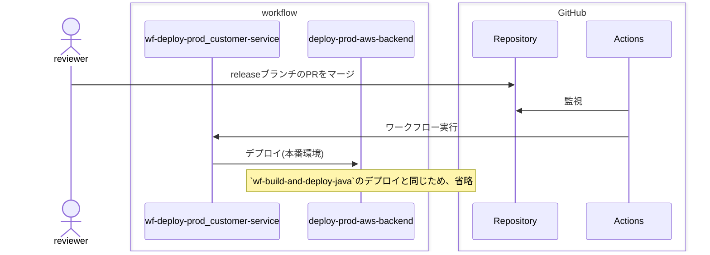

# サンプルコードの説明

## サンプルコード構成

* :file_folder: .github
  * pull_request_template.md：PRテンプレート ※1
  * release.yaml：リリースノート自動生成 ※1
  * dependabot.yml：dependabotによる依存関係の監視　※1
  * :file_folder: workflows: ワークフロー
    * wf-build-and-deploy-java.yaml: バックエンド（Java）のビルド～開発環境へのデプロイ ※2
    * wf-build-and-deploy-react.yaml: フロントエンド（SSG）のビルド～開発環境へのデプロイ ※2
    * wf-build-and-deploy-ts.yaml: バックエンド（TypeScript）のビルド～開発環境へのデプロイ ※2
    * wf-build-java.yaml: バックエンド（Java）のビルド ※2
    * wf-build-react.yaml: フロントエンド（SSG）のビルド ※2
    * wf-build-ts.yaml: バックエンド（TypeScript）のビルド ※2
    * wf-deploy-prod_customer-service.yaml: 本番環境への顧客サービスのデプロイ ※3
    * wf-deploy-prod_order-service.yaml: 本番環境への受注サービスのデプロイ ※3
    * wf-deploy-stage_customer-service.yaml: ステージング環境への顧客サービスのデプロイ ※3
    * wf-deploy-stage_order-service.yaml: ステージング環境への受注サービスのデプロイ ※3
    * _build-image.yaml: イメージビルド ※2
    * _build-java-app.yaml: Java+Mavenアプリケーションビルド ※2
    * _build-react-app.yaml: Reactアプリケーションビルド ※2
    * _build-ts-app.yaml: TypeScript+Nodeアプリケーションビルド ※2
    * _deploy-aws-backend.yaml: バックエンドのデプロイ ※2
    * _deploy-aws-frontend.yaml: フロントエンドのデプロイ ※2
    * _deploy-dev-aws-backend.yaml: バックエンドの開発環境へのデプロイ ※2
    * _deploy-dev-aws-frontend.yaml: フロントエンドの開発環境へのデプロイ ※2
    * _deploy-prod-aws-backend.yaml: バックエンドの本番環境へのデプロイ ※2
    * _deploy-stage-aws-backend.yaml: バックエンドのステージング環境への ※2
    * _load-config.yaml: 設定ファイルの読み込み ※2
    * _publish-report.yaml: レポート公開 ※2
    * :file_folder: template: テンプレート
      * workflow-config.yaml: ワークフロー設定ファイルのテンプレート ※2

※_xxx.yaml: 再利用可能ワークフロー（端的に言うと部品化されたワークフローで、他ワークフローから呼び出されることが前提になります）
※1: そのまま利用可能  
※2: 技術スタックが同じなら、そのまま利用可能  
※3: これを例としてアプリケーションに合わせた実装が必要。
※フロントエンドのステージング、本番へのデプロイワークフローは特化したものの量産にしかならないので省略しています

## サンプルコードの流れ

### wf-build-java, wf-build-ts

featureからdevelopブランチへのPRの作成、変更、リオープンをトリガーとしたワークフロー。
後述する`wf-build-and-deploy-java`の「アーティファクト公開」、「イメージ公開」、「デプロイ」のないものが、当ワークフローの流れになります。  
重複部分が多いので、フローは省略します。  

### wf-build-react

featureからdevelopブランチへのPRの作成、変更、リオープンをトリガーとしたワークフロー。
後述する`wf-build-and-deploy-react`の「デプロイ」のないものが、当ワークフローの流れになります。  
重複部分が多いので、フローは省略します。  

### wf-build-and-deploy-java, wf-build-and-deploy-ts

developブランチへのプッシュをトリガーとしたワークフロー。
両者とも基本的な流れは同じなので`wf-build-and-deploy-java`を例に説明します。



### wf-build-and-deploy-react

developブランチへのプッシュをトリガーとしたワークフロー。
基本的な流れは`wf-build-and-deploy-java`と同じ。
コンテナー駆動ではないためイメージビルドがないのと、実行環境で使用するサービスが異なります。



### wf-deploy-stage_customer-service, wf-deploy-stage_order-service

releaseブランチへのプッシュをトリガーとしたワークフロー。



### wf-deploy-prod_customer-service, wf-deploy-prod_order-service

mainブランチへのプッシュをトリガーとしたワークフロー。
デプロイ処理の流れは`wf-build-and-deploy-java`のデプロイ同じため、省略します。



## Appendix. アプリの設定例

* TypeScriptアプリケーション
  ```json
  {
    "scripts": {
      // # ビルドが実行されるスクリプトの設定
      // * UI(SSG)なら静的コンテンツ、backendならnpmモジュールのビルド
      // * vite, nestなど採用しているミドルによってコマンドが変わるので、これらの差異をアプリで吸収することを目的としています。
      // ## UI(SSG)の場合:環境別のビルドを区別したいので、環境別にコマンドを作成
      // * Suffixのないスクリプトはアプリケーション新規作成時に作成されます。その他は設定ファイルの切り替え方法に合わせて追加が必要です。
      "build": "tsc -b && vite build",
      "build:dev": "tsc -b && vite build --mode dev",
      "build:stage": "tsc -b && vite build --mode stage",
      "build:prod": "tsc -b && vite build --mode prod",
      // ## backendの場合:環境情報は外部から注入できるので環境別にコマンドを作成する必要はありません
      // * 基本、アプリケーション新規作成時に作成されます。
      "build": "nest build",

      // # 静的解析が実行されるスクリプトの設定
      // * 基本、アプリケーション新規作成時に作成されます。
      "lint": "eslint \"{src,apps,libs,test}/**/*.ts\" --fix",

      // # テスト実行、カバレッジレポート生成およびテスト結果生成が実行されるスクリプトの設定
      // * ローカルとは区別しておく方が良いのでSuffixを付けています。
      //   * ローカルと同じにすると、ローカルでテストを実行する度、レポートが生成されて重く邪魔になってしまう
      "test:ci": "jest --coverage",
    },
    // # テスト結果の出力設定
    // * カバレッジレポートやテスト結果は、特定の場所に集約してください。サンプルコードでは`test-result`配下に集約しています。
    //    * テスト結果の取得先が散在するとその分亜流が増えるため、これを抑止することを目的としています。
    "jest": {
      "moduleFileExtensions": [
        "js",
        "json",
        "ts"
      ],
      "rootDir": "src",
      "testRegex": ".*\\.spec\\.ts$",
      "transform": {
        "^.+\\.(t|j)s$": "ts-jest"
      },
      "collectCoverageFrom": [
        "**/*.(t|j)s"
      ],
      "coverageDirectory": "../test-result/coverage",
      "testEnvironment": "node",
      "coverageReporters": ["text", "lcov"],
      "reporters": [
        "default",
        [
          "jest-html-reporters",
          {
            "publicPath": "./test-result/test-report",
            "filename": "index.html",
            "expand": true
          }
        ]
      ]
    }
  }  
  ```
